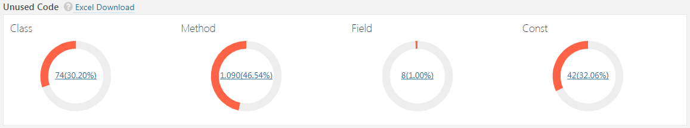
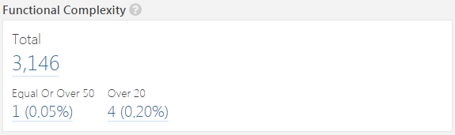

# 사용자 가이드

## Sonar Server Setup
* `sonar-RedCA-plugin-X.X.X.jar` 파일을 `SonarQube 설치디렉토리\extensions\plugins`로 이동 시킵니다.
* SonarQube 서버를 재기동 합니다.

## Analyzing Source Code
분석할 소스의 root에 `[sonar-project.properties](https://docs.sonarqube.org/7.4/analysis/analysis-parameters/)' 파일을 생성하고,
추가로 다음 항목들을 설정해 줍니다.

    # SonarQube RedCA Plugin 관련 추가 설정 항목
    # 소스코드 경로
    # 설정하지 않을 경우 분석 시작위치는 sonar-project.properties 파일의 위치
    sonar.sources=src/main/java
    
    # compile된 class 파일 경로 (FindBugs 등에서 사용)
    sonar.java.binaries=target/classes
    
    # 소스코드 인코딩 정보
    sonar.sourceEncoding=UTF-8
    
    # 소스코드에서 사용된 자바 버전 정보
    sonar.java.source=1.8
     
    ...
     
     
소스를 스캔합니다.   
  
    $스캔대상프로젝트Root> sonar-scanner

## Dashboard 확인
* Sonar Scanner 실행이 완료되면, SonarQube에서 분석 결과를 확인 할 수 있습니다.
* Projects >  Project를 선택 >  More > RedCA Dashboard 

## Dashboard 항목
### Size

1. Lines Of Code
   * NCLOC( Non-Comment Lines of Code)
   * 공백, 주석을 제외한 코드 라인 수
2. Lines
   * 공백, 주석을 포함한 전체 라인 수
3. Files
   * 파일 수
4. Directories
   * 디렉토리 수
5. Functions
   * function 수
   * 단, 사용 언어에 따라서 다른 기준 적용 (https://docs.sonarqube.org/display/SONAR/Metrics+-+Functions 참조)
6. Classes
   * 클래스 수 (nested class, interface, enums, annotations 포함)
7. Statements
   * Statement 수 (https://docs.sonarqube.org/display/SONAR/Metrics+-+Statements 참조)
   
### Technical Debt

1. Total 
   * 전체 Technical Debt 합
2. Issues(Inspections) 
   * Issue effort
3. Duplication 
   * Duplicated Blocks Count * 2.0MH
4. Complexity   
   * Complexity 20초과 건수 * 1.0MH
5. Package Stability   
   * Cycle Dependency 건수 * 4.0MH
### Issues(Inspection)

1. Issues
   * 전체 coding rule 위반 건수
2. Severities(심각도)
   * Blocker
     * application의 동작에 영향을 줄 가능성이 높은 버그, 반드시 수정되어야 함
     * ex) memory leak, unclosed JDBC connection…
   * Critical
     * application의 동작에 영향을 줄 가능성이 낮은 버그 또는 보안결함, 즉시 검토 필요
     * ex) empty catch block, SQL injection….
   * Major
     * 개발자의 생산성에 큰 영향을 줄 수 있는 품질 결함
     * ex) uncovered piece of code, duplicated blocks, unused parameters…
   * Minor
     * 개발자의 생산성에 약간의 영향을 줄 수 있는 품질 결함
     * ex) lines should not be too long, "switch" statements should have at least 3 cases, ...
   * Info
     * Information
3. Rule Type
   * Bug
     * 명백하게 잘못된 코드
   * Vulnerabilities
     * 해커가 악용할 수 있는 코드
   * Code Smells
     * bug, vulnerability를 제외한 코드
Issues Rules Top 5
### Unused Code

1. Class 
   * Unused Code를 포함하는 Class의 개수
   * (Unused Code를 포함하는 Class 수 / 전체 Class 수) * 100
2. Method 
   * Unused Code를 포함하는 Method의 개수
   * (Unused Code를 포함하는 Method 수 / 전체 Method 수) * 100
3. Field 
   * Unused Code를 포함하는 Field 의 개수
   * (Unused Code를 포함하는 Field 수 / 전체 Field 수) * 100
4. Const 
   * Unused Code를 포함하는 Const 의 개수
   * (Unused Code를 포함하는 Const 수 / 전체 Const 수) * 100
### Duplicated Lines

1. Duplicated Lines (%)
   * 중복 라인 비율
   * (Duplicated Lines / Lines) * 100
2. Duplicated Line
   * 중복 라인 수
3. Duplicated Blocks
   * 중복된 라인 블록 수
   * duplicated block 판단 기준
     * JAVA : 10개 이상의 연속적으로 중복된 statement
     * COBOL : 30라인 내에 100개 이상의 연속적으로 중복된 token
     * ABAP : 20라인 내에 100개 이상의 연속적으로 중복된 token
     * 기타 : 10라인 내에 100개 이상의 연속적으로 중복된 token
4. Duplicated Files
   * 중복된 파일 수
5. Duplication Files Top 5 
   * 중복라인 수가 큰 파일 Top 5
### Functional Complexity

1. Total 
   * 전체 Complexity의 합
2. Equal or Over 50 
   * Complexity 50 이상인 Function 개수( x >=50 )
3. Over 20 
   * Complexity 20 초과인 Function 개수 ( x > 20 )
   
### Comments

1. Comments(%)
   * 전체 소스의 주석 비율
   * Comment lines / (Lines of code + Comment lines) * 100
2. Comment Lines
   * 주석 라인 수
### Cycle Dependency

   * JDepend 기반의 순환참조 리스트
2. Total 
   * 전체 순환참조 개수
3. Cycle Dependency List 
   * 순환참조 리스트
### Martin Metrics

  * https://www.future-processing.pl/blog/object-oriented-metrics-by-robert-martin/ 참조

